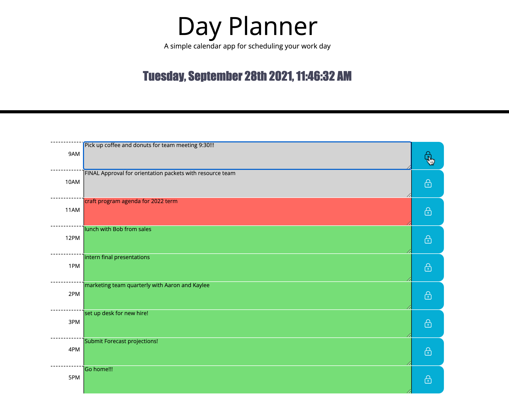

# Day Planner

## Repo Contents

<li>README.md</li>
<li>index.html</li>
<li>style.css</li>
<li>Assets</li>

<br />

<br />

## The Ask

Using HTML, CSS and JQuery, create a day planner web app that allows the user to save events for each hour of the day.

<br />

## User Story

AS AN employee with a busy schedule
I WANT to add important events to a daily planner
SO THAT I can manage my time effectively

<br />

## Criteria

```
When opening app, the current time/date is displayed.

Planner contains empty blocks for each hour of the business day.

blocks are color coded to represent time past, present, future.

selecting a block allows user to enter event.

Event displayed in block and saved in localStorage.

All keyed events persist on refresh.
```

<br />

## Deployed URL

https://github.com/djdyer/day-planner
<br />
https://djdyer.github.io/day-planner
<br />
